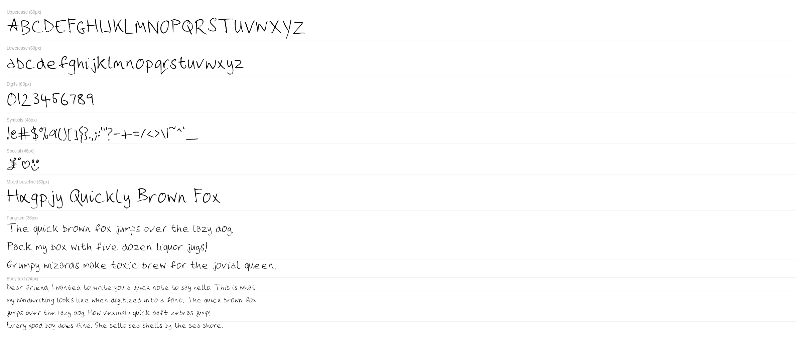
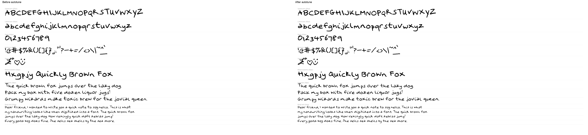

# hw2font

Turn scanned handwriting templates into usable OpenType fonts, proof sheets, and webfonts.



## What it does

`hw2font` is a local pipeline for taking filled-in handwriting template scans and producing:

- a compiled `.otf` font,
- proof images for visual review,
- optional autotune logs and spacing adjustments,
- `.woff2` / `.woff` webfont assets plus ready-to-paste CSS.

The pipeline is built around five stages:

1. **Template generation** - produce a printable writing sheet
2. **Extraction** - deskew scans, crop glyphs, measure baselines
3. **Compilation** - vectorize with Potrace and build with FontForge
4. **Proofing** - render specimen sheets for quick visual review
5. **Autotune** - optionally refine spacing and geometry before final output

## Features

- Multi-page handwriting template generation
- Registration-mark-based scan alignment
- Automatic glyph extraction and baseline measurement
- Potrace vectorization
- FontForge compilation to `.otf`
- Contextual alternates for multi-set handwriting variation
- Ligature support
- Configurable spacing:
  - per-glyph `scale`
  - per-glyph vertical `nudge`
  - per-glyph horizontal `hshift`
  - global `tightness`
  - global `space_width`
  - configurable kerning rules
- Default-on **autotune** with logs and per-set control knobs
- Webfont export to `.woff2` / `.woff`

## Example outputs

### Final proof output

The proof command renders a specimen sheet from a compiled font:


### Autotune before/after comparison

This is the same Sailor font before and after autotune:



## Requirements

### Python

- Python **3.14+**
- [`uv`](https://docs.astral.sh/uv/)

### System dependencies

On macOS with Homebrew:

```bash
brew install potrace fontforge
```

Python dependencies are managed by `uv` and are declared in [`pyproject.toml`](pyproject.toml).

## Installation

Clone the repo, then sync dependencies:

```bash
git clone <your-repo-url> hw2font
cd hw2font
uv sync
```

You should now have the CLI available as:

```bash
uv run hw2font --help
```

## Project layout

```text
hw2font/
├── PRD.md
├── pyproject.toml
├── src/hw2font/
│   ├── cli.py
│   ├── constants.py
│   ├── autotune/
│   │   └── engine.py
│   ├── compile/
│   │   └── builder.py
│   ├── extract/
│   │   └── pipeline.py
│   ├── proof/
│   │   └── sheet.py
│   └── template/
│       └── generator.py
├── images/
│   ├── extract1.png
│   ├── extract2.png
│   ├── alt1.png
│   ├── alt2.png
│   └── ...
└── output/   # generated artifacts; gitignored
```

## Quick start

If you already have scans and a config:

```bash
uv run hw2font build re5p-config.toml
```

That will:

- extract all configured scan sets,
- run autotune by default,
- compile the final `.otf`,
- generate set-by-set preview proofs,
- write autotune logs beside the output font.

## Typical workflow

### 1) Generate a blank template

```bash
uv run hw2font template -o output/template.pdf
```

Print the PDF, fill it in, then scan it at **600 DPI**.

### 2) Extract glyphs from scans

```bash
uv run hw2font extract images/extract1.png images/extract2.png -o output/extracted
```

This writes:

- cropped glyph PNGs to `output/extracted/glyphs/`
- extraction metadata to `output/extracted/metadata.json`

### 3) Compile a single-set font

```bash
uv run hw2font compile \
  --input output/extracted \
  --output output/My_Handwriting.otf \
  --config re5p-config.toml
```

### 4) Generate a proof sheet

```bash
uv run hw2font proof \
  --font output/My_Handwriting.otf \
  --output output/proof.png \
  --no-open
```

### 5) Build a multi-set font with alternates

```bash
uv run hw2font build sailor-config.toml
```

### 6) Export webfonts

```bash
uv run hw2font webfont output/EWJ_Handwriting_REF5P.otf \
  --output-dir output/webfonts \
  --with-woff \
  --url-prefix /fonts
```

## CLI reference

Top-level help:

```bash
uv run hw2font --help
```

Available commands:

- `template` - generate a printable template PDF
- `extract` - extract glyph bitmaps and metadata from scans
- `compile` - compile a single extracted set into a font
- `build` - extract and compile a multi-set font from TOML config
- `proof` - render a proof image from a font
- `webfont` - convert a built font into `.woff2` / `.woff` and CSS

## Command reference

### `template`

Generate the printable handwriting template:

```bash
uv run hw2font template --output output/template.pdf
```

### `extract`

Extract glyphs from one image per template page:

```bash
uv run hw2font extract SCAN1.png SCAN2.png --output output/extracted --dpi 600
```

### `compile`

Compile a single extracted set:

```bash
uv run hw2font compile \
  --input output/extracted \
  --output output/Handwriting.otf \
  --dpi 600 \
  --config re5p-config.toml
```

### `build`

Full multi-set pipeline from config:

```bash
uv run hw2font build re5p-config.toml
```

Useful options:

```bash
uv run hw2font build re5p-config.toml \
  --output output/REF5P.otf \
  --dpi 600 \
  --autotune-log output/REF5P_autotune.json \
  --autotune-max-iterations 2
```

Disable autotune for comparison:

```bash
uv run hw2font build re5p-config.toml --no-autotune
```

### `proof`

Render a proof PNG:

```bash
uv run hw2font proof --font output/REF5P.otf --output output/proof.png
```

### `webfont`

Convert a font to web assets:

```bash
uv run hw2font webfont output/REF5P.otf \
  --output-dir output/webfonts \
  --with-woff \
  --url-prefix /fonts
```

This writes:

- `REF5P.woff2`
- optional `REF5P.woff`
- `REF5P.css`

Example emitted CSS:

```css
@font-face {
  font-family: "EWJ Handwriting REF5P";
  src: url("/fonts/REF5P.woff2") format("woff2"),
       url("/fonts/REF5P.woff") format("woff");
  font-weight: normal;
  font-style: normal;
  font-display: swap;
}
```

## Config files

The main build workflow is driven by TOML config files such as:

- [`re5p-config.toml`](re5p-config.toml)
- [`sailor-config.toml`](sailor-config.toml)

### Minimal example

```toml
name = "My Handwriting"
tightness = 1.0
space_width = 300

[kern]
overhang_lc = -120
round_lc = -60
straight_lc = -40
open_lc = -50

[[sets]]
scans = ["images/page1.png", "images/page2.png"]

[[sets]]
scans = ["images/alt-page1.png", "images/alt-page2.png"]
```

### Supported top-level keys

- `name` - font family name
- `tightness` - global side-bearing multiplier; higher values feel more condensed
- `space_width` - width of the space glyph in font units
- `[kern]` - global kerning defaults and overrides
- `[[sets]]` - one or more scan sets
- `[autotune]` - optional global autotune controls

### Supported per-set keys

Inside each `[[sets]]` entry:

- `scans` - list of scan file paths
- `overrides` - per-glyph tweaks
- `kern` - per-set kerning overrides
- `borrow` - borrow specific glyphs from another set
- `autotune` - set-specific autotune controls

## Per-glyph overrides

Under `[[sets]].overrides`, each glyph can have:

- `scale` - resize the glyph
- `nudge` - move vertically in pixels
- `hshift` - move horizontally in pixels

Examples:

```toml
[[sets]]
scans = ["images/page1.png", "images/page2.png"]
overrides.a.scale = 0.9
overrides.g.nudge = -10
overrides.".".nudge = 20
overrides."0".scale = 0.85
overrides.th.scale = 1.1
```

## Kerning config

Global and per-set kerning support:

- class-based uppercase-to-lowercase defaults
- right-side blanket rules
- left-side blanket rules
- explicit pair overrides

Example:

```toml
[kern]
overhang_lc = -120
round_lc = -60
straight_lc = -40
open_lc = -50

right.x = -40
left.o = -20
pairs.Ta = -150
```

## Tightness and spacing

Two main knobs control how condensed a font feels:

### `tightness`

`tightness` changes side-bearing spacing globally.

- `1.0` = default
- `> 1.0` = tighter / more condensed
- `< 1.0` = looser

Example:

```toml
tightness = 1.25
```

### `space_width`

Controls the width of the space character in font units.

Example:

```toml
space_width = 220
```

Use both together:

- `tightness` for letter-to-letter feel
- `space_width` for word spacing

## Autotune

`build` runs autotune by default.

Autotune can:

- suggest `scale` changes,
- suggest `hshift` changes,
- add deterministic kerning pair overrides,
- write JSON and text logs of everything it changed.

### Log files

By default:

```text
output/My_Font_autotune.json
output/My_Font_autotune.txt
```

Use a custom log path:

```bash
uv run hw2font build re5p-config.toml \
  --autotune-log output/custom_autotune.json
```

### Autotune control knobs

You can tell autotune to leave specific things alone.

Per set:

```toml
[[sets]]
scans = ["images/page1.png", "images/page2.png"]

[sets.autotune]
disable_hshift = ["L"]
disable_scale = ["Q"]
disable_kern_pairs = ["Ta"]
```

Available control lists:

- `disable_hshift`
- `disable_scale`
- `disable_kern_pairs`

These are especially useful when autotune is broadly correct but over-adjusts a specific glyph or pair.

## Multi-set fonts and alternates

If you provide multiple `[[sets]]`, `hw2font` builds a font with contextual alternates so the handwriting varies naturally while typing.

Common pattern:

- **set 0** = your primary glyphs
- **set 1+** = alternate forms

You can also borrow a specific glyph from another set:

```toml
[[sets]]
scans = ["images/page1.png", "images/page2.png"]
borrow."-" = 1
```

## Output artifacts

Typical generated files in `output/`:

- `*.otf` - compiled font
- `proof.png` - specimen sheet
- `proof_set0.png`, `proof_set1.png` - set-by-set proof sheets
- `*_autotune.json` - machine-readable tuning log
- `*_autotune.txt` - human-readable tuning log
- `webfonts/*.woff2`, `webfonts/*.woff`, `webfonts/*.css`

## Troubleshooting

### The font feels too loose

Try:

- increasing `tightness`
- reducing `space_width`
- adding targeted kerning overrides

### A single glyph is too high, low, wide, or shifted

Use per-glyph overrides:

```toml
overrides.g.nudge = -10
overrides.a.scale = 0.9
overrides.y.hshift = -6
```

### Autotune over-corrected a glyph

Disable that adjustment in config:

```toml
[sets.autotune]
disable_hshift = ["L"]
disable_scale = ["Q"]
```

### A descender tucks correctly but another glyph became too tight

The compiler now uses:

- **above-baseline body width** for descender classes
- **full bounding-box width** for non-descenders

If spacing still needs work, prefer kerning or `tightness` before per-glyph hacks.

### Webfont conversion fails

Make sure Python dependencies are installed:

```bash
uv sync
```

`woff2` generation relies on the Python `brotli` package, which is included in this project.

## Development

Run tests with:

```bash
uv run pytest tests/ -q
```

Inspect command help:

```bash
uv run hw2font --help
uv run hw2font build --help
uv run hw2font webfont --help
```

## Related files

- [`PRD.md`](PRD.md) - product and architecture requirements
- [`re5p-config.toml`](re5p-config.toml) - example config for the REF5P font
- [`sailor-config.toml`](sailor-config.toml) - example config for the Sailor font

## License / usage

This repo currently assumes local, personal font generation workflows. Add whatever license and distribution terms you want before publishing more broadly.
